# Synthetically Supervised Feature Learning for Scene Text Recognition

> ECCV 2018 accepted
>
> - Yang Liu(1), Zhaowen Wang(2), Hailin Jin(2), and Ian Wassell(1)
>   1. Computer Laboratory, University of Cambridge, UK
>   2. Adobe Research, California, US
>
> [paper](http://openaccess.thecvf.com/content_ECCV_2018/papers/Yang_Liu_Synthetically_Supervised_Feature_ECCV_2018_paper.pdf)

### 0. Keywords

Scene Text Recognition, Deep Learning, Neural Networks, Feature Learning, Synthetic Data, Multitask Learning

Scene Text Recognition 필드에서 Synthetic Data 와 Multitask Learning 기법을 조합한 첫 시도로서의 의미를 갖는다.

### 1. Introduction

- Scene Text Recognition 이란 Natural scene image 로 부터 Text 를 인식시키는 문제를 의미한다
- 이는 다양한 산업환경에서 광범위하게 적용될 수 있기 때문에, 오래전부터 연구되어 왔다.
- Hand-crafted features 를 이용하는 방법부터 최근 SOTA 를 갱신하고 있는 Convolutional Neural Networks 까지 다양한 방법이 있는데, 
- 최근 SOTA 를 찍는 NN모델들의 핵심은 엄청난크기의(Large-scale) 합성이미지(Synthetic image dataset)를 학습에 사용하며(실제로 Recongition 학습때는 인식용데이터만 천만장이상 사용한다), 그 합성 데이터의 수준을 점점 높히며 모델 역시 함께 개선해가는 방법을 사용한다.
- 이는 OCR Recognition Task 는 합성데이터와 실제데이터의 간극이 크지 않기 때문이라는 특징이 있음

> The key idea of this work is that we can leverage the difference between real and synthetic images, namely the controllability of the generation process, and control the generation process to generate paired training data. Specifically, for every synthetic image out of the generation process with aforementioned nuisance fac- tors, we obtain the associated rendering parameters, manipulate the parameters, and generate a corresponding clean image where we remove part or all of the nuisance factors.

- 따라서 Training label 을 이용해, Nuisance real domain Image -> Clean synthetic domain image 로 페어를 만들 수가 있고, 우리는 이를 이용해 더 깨끗하고, Classification 에 더 도움이 되는 명확한 Feature 를 학습하게 하는 구조를 제안한다 고 주장한다.

### 2. Proposed Architecture

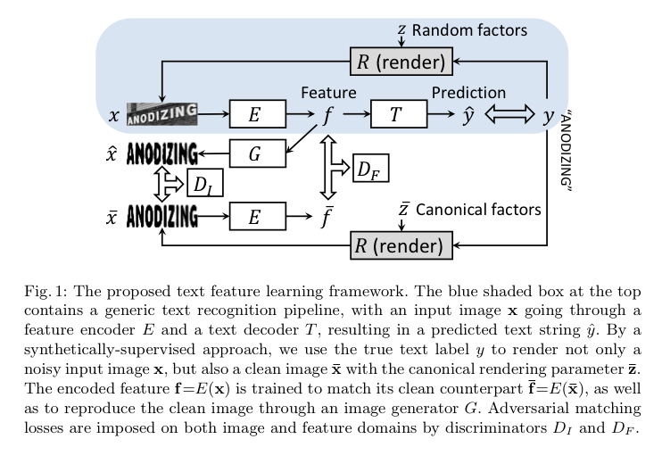

- 제안된 구조의 핵심은 CNN Encder E() 가 더 좋은 Feature 인 f 를 배우도록 도와주는 것
- Input X 를 Classify 하는 더 핵심적이고 명확한 평면을 학습할 수 있는 추가적인 모멘텀 또는 Regularization 을 가하는 형태라고 볼 수 있다.
- 이 구조에서는 Total Loss 를 구하기 위한 **5개의 Loss Term** 을 구성, 이들을 일정한 비율로 **Multitask Learning** 을 진행하는 것
- 첫번째는, 일반적으로 사용하는 => **CRNN Loss Term (1)**
  - CRNN 모델을 Baseline 으로 사용했기 때문에, Decoder 부분을 CTC(Connectionist Temporal Classification) Layer 를 사용
  - 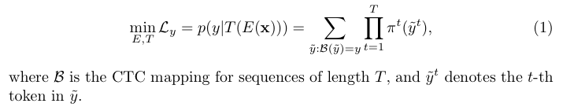
  - 관련한 자세한 설명은 CRNN 기법을 처음 소개한 [paper](https://arxiv.org/abs/1507.05717) 를 참고하면 좋다.
  - 사실 최근 트랜드와 실험결과에 따르면 CTC 를 사용하는 것보다 Attention Decoder 를 사용하는 것이 거의 모든 경우 성능향상이 있기 때문에, 모델 성능의 개선포인트가 있음
- 두번째는 Feature Learning with E(X) => **$$D_f$$ Loss Term (2)**
  - noised image X 와 generated image $$\bar{X}$$  를 동일한 Encoder E 에 통과시키고, 뽑아낸 Feature f 에 대해서 L2 Loss 를 걸어, 둘이 비슷한 벡터공간에 매핑되도록 유도하는 Term
  - 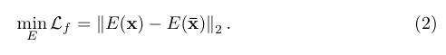
- 세번째는 Reconstruct 한 이미지 $$\hat{X}$$ 의 Ideal Reconstruct image $$\bar{X}$$ 에 대한 **$$G_i$$ Loss Term (3)**
  - f 를 이용하여 Reconstruct 한 결과인 $$\hat{X}$$ 에 대한 L1 Loss Term 도 걸어준다
  - 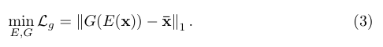
  - Encoder E 의 결과물 Feature f 에 대해서, 우리가 원하는 Clean Domain 에 대한 Reconstruct Task 를 추가하는 것
  - Shape 를 sharp 하게 잡기 위해서 L1 을 걸어준 것 같지만, L2, CE 등의 여러가지 Exp 가 필요하다
- 네번째와 다섯번째는 (2) 와 (3) 의 **Adversarial Discriminator Loss Term (4,5)**
  - GAN(Generative adversarial network) 에서 아이디어를 차용한 것
  - G(E(X)) / E(X) 간의 pixel level similarity 가 아닌 distributional similarity 를 구하는 목적으로 사용하였다고 저자는 설명하였다.
  - 이를 Reconstruct Image 에 대한 것과, Encoded Feature 에 대한 Task 모두에게 적용한다.
  - 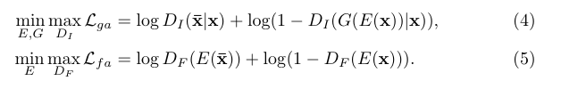
- 따라서 **Total Loss** 는 위 5개의 Loss Term 을 모두 만족시키는 Multitask Learning Loss 를 구성한다
  - 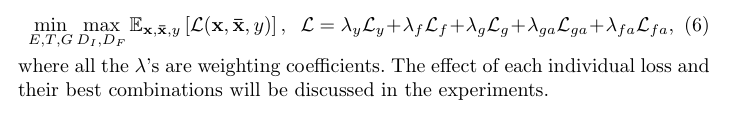
  - ML Task 에서 각 Loss Term 간의 Scale 을 어떻게 조절할지에 대한 것은 아직도 Domain Dependent 하고, Open Problem 으로 남아있는 상태이다. 
  - 논문에서도 언급했다시피, 실험을 통해서 가장 목적을 달성하는 Lambda 값을 찾아가는 것이 일반적이다(하이퍼파라미터 튜닝이 필요하다)

### 3. Implementation Details

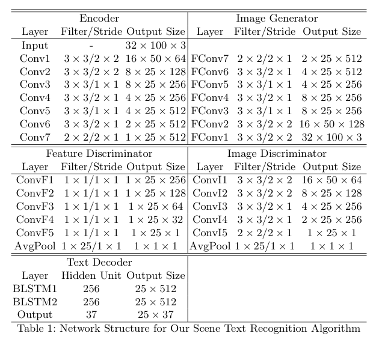

### 4-1. Results and Comparision on General Benchmarks

- IIIT5K
- SVT(Street View Text)
- IC03(ICDAR 2003)
- IC13(ICDAR 2013)

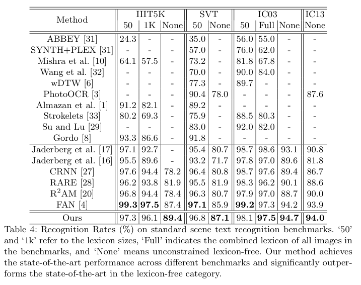

### 4-2. Results and Comparisions on Irregular Benchmark

- SVT-P(SVT-Perspective)
- CUTE80

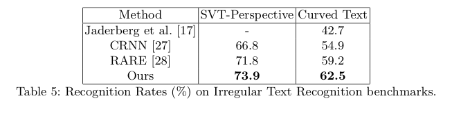

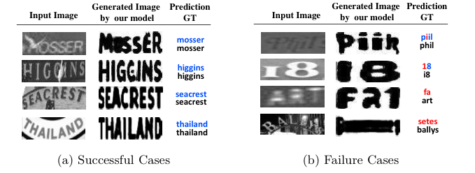

### 5. Ablation Study

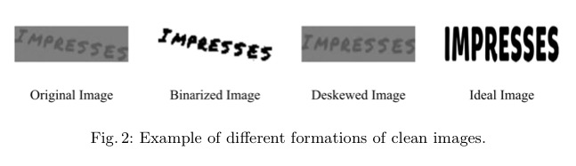

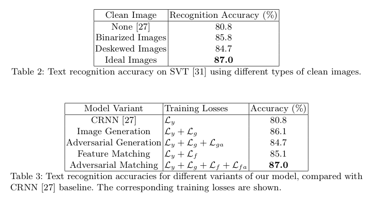

### 6. Conclusion and Contribution

- Synthetic data generation process 와 OCR Recognition Field 에서는 처음으로 multi-task learning 방법을 적용하였다
- Encoder-generator-discriminator-decoder 구조로 clean image 로 부터 feature learning 을 하였다
- 그리하여 generalized benchmark dataset 에서 SOTA 를 찍어냈다
- 추가로 severe geometric distortion 이 있는 이미지에 대해서도 강인한 효과를 보였다
- 그 과정에서 추가적인 explicit handling 이 없었다 (FAN paper 를 겨냥하고 말하는 듯함)

